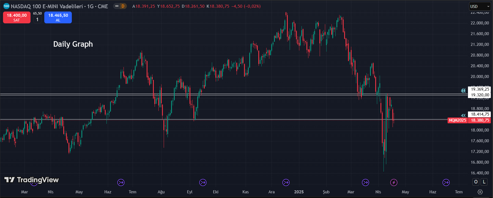
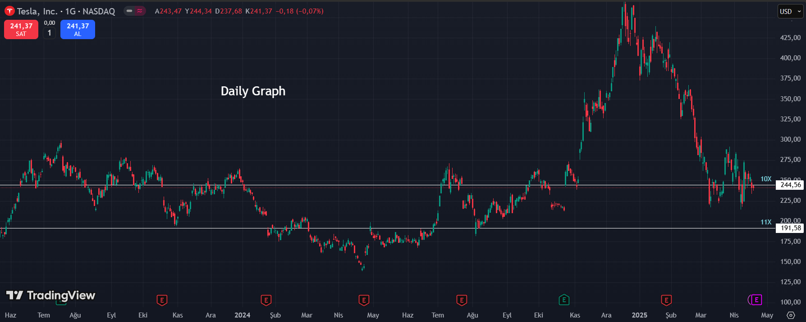

# Supply Demand Analysis Tool

This project aims to analyze a given dataset to identify the most frequently repeated values. The analysis module, named "RealSupplyDemand", highlights the data points that occur most often. The more frequently a value appears, the more significant it becomes.

These high-frequency levels behave like real supply and demand zones, making them critical for making strategic decisions or deriving insights from the data. Additionally, these values are suitable for use in both low time frames (minute, hour) and high time frames (day, week).

Note: When selecting the start and end dates, choosing a wider time range will provide more accurate and reliable results.
Example: start date: 2024-01-01, end date: 2025-04-01

The project consists of two main components:

1. Stock data retrieval and analysis tool
2. Duplicate value analysis tool

## Features

- Fetch stock data through Yahoo Finance API
- Analyze high and low price levels
- Determine potential supply-demand levels using quadrant analysis
- Detect and count duplicate values
- Save results to Excel files

## Requirements

- Python 3.x
- openpyxl
- yfinance
- pandas
- datetime

To install the required libraries:

```bash
pip install openpyxl yfinance pandas
```

## Usage

### 1. Stock Data Analysis (stock_analysis.py)

```bash
python stock_analysis.py
```

The program will prompt you for the following information:
- Stock symbol (e.g., AAPL, TSLA, ^GSPC)
- Start date (in YYYY-MM-DD format)
- End date (in YYYY-MM-DD format)
- Output file name

### 2. Duplicate Value Analysis (duplicate_analyzer.ipynb)

Open the Jupyter Notebook and run the cells in sequence. Analysis results will be automatically saved to an Excel file.

## Outputs

1. When running `stock_analysis.py`:
   - High and low price levels for the specified stock
   - Quadrant analysis results
   - All data saved to an Excel file

2. When running `duplicate_analyzer.ipynb`:
   - List of duplicate values
   - Count of each duplicate value
   - Results saved to an Excel file

## Example Analysis Results

### NASDAQ-100 Analysis
Daily and Weekly timeframes showing supply-demand levels:


Daily timeframe with identified supply-demand zones:
.png)

### Tesla (TSLA) Analysis
Daily timeframe with identified supply-demand zones:


Daily timeframe showing supply-demand levels:
.png)

## Contributing

1. Fork this repository
2. Create a new branch (`git checkout -b feature/amazing-feature`)
3. Commit your changes (`git commit -m 'Add some amazing feature'`)
4. Push to the branch (`git push origin feature/amazing-feature`)
5. Create a Pull Request

## License

This project is licensed under the MIT License. See the [LICENSE](LICENSE) file for details.

## Contact

Project Owner - [@yourusername](https://github.com/yourusername)

Project Link: [https://github.com/yourusername/realsupplydemand](https://github.com/yourusername/realsupplydemand)

